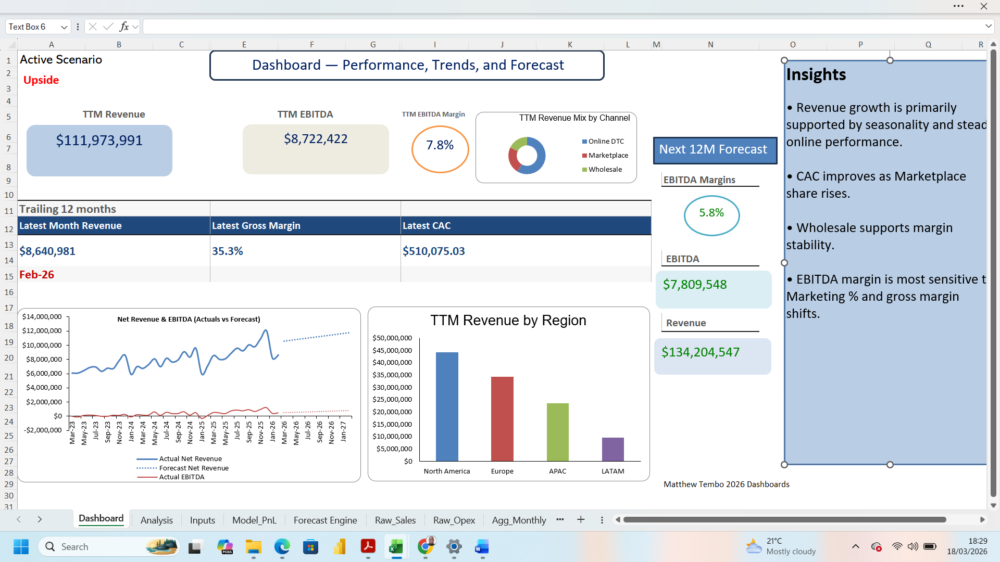
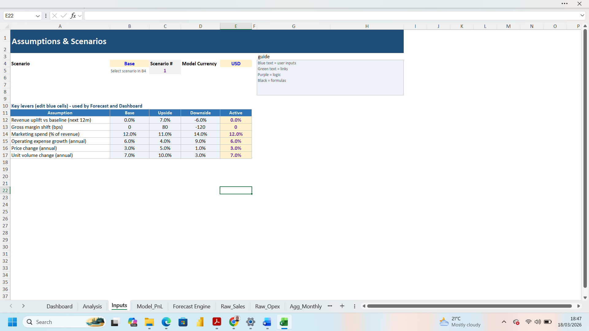
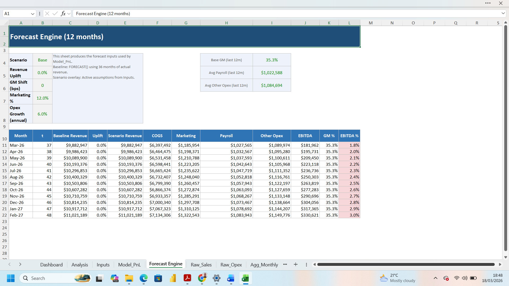

# Scenario-Based Financial Performance Dashboard in Excel

## Overview
This project is a scenario-based financial analytics dashboard built entirely in Excel. It combines raw operational data, monthly aggregation, financial modeling, forecasting, and executive-level dashboarding into one end-to-end analytical solution.

The workbook allows users to switch between **Base**, **Upside**, and **Downside** scenarios to evaluate how changes in revenue, gross margin, marketing intensity, and operating expense growth affect business performance.

## Project Objective
The objective of this project was to build an interactive Excel model that supports:
- historical performance review
- KPI tracking
- scenario analysis
- 12-month forecasting
- management reporting

## Tools Used
- Microsoft Excel
- Financial modeling
- Scenario analysis
- Forecasting
- Dashboard design

## Workbook Structure
- **Raw_Sales**: transaction-level revenue data
- **Raw_Opex**: operating cost data
- **Agg_Monthly**: monthly revenue, COGS, and marketing summary
- **Agg_Opex**: monthly payroll and other opex summary
- **Model_PnL**: monthly profit and loss model
- **Inputs**: scenario assumptions and controls
- **Forecast Engine**: forward-looking forecast model
- **Analysis**: KPI and summary analysis
- **Dashboard**: executive dashboard

## Key Metrics Included
- Revenue
- Gross Margin
- CAC
- TTM Revenue
- TTM EBITDA
- TTM EBITDA Margin
- Revenue by Region
- Revenue by Channel
- Forecast Revenue
- Forecast EBITDA

## Scenario Assumptions
### Base
- Revenue uplift: 0%
- Gross margin shift: 0 bps
- Marketing: 12% of revenue
- Opex growth: 6%

### Upside
- Revenue uplift: +7%
- Gross margin shift: +80 bps
- Marketing: 11% of revenue
- Opex growth: 4%

### Downside
- Revenue uplift: -6%
- Gross margin shift: -120 bps
- Marketing: 14% of revenue
- Opex growth: 9%

## Key Insight
The model shows that while historical revenue growth is strong, future profitability is highly sensitive to gross margin pressure, marketing intensity, and operating expense growth. In the Base case, the business remains growing but margin compresses. In the Upside case, profitability improves. In the Downside case, EBITDA turns negative.

## Screenshots

### Dashboard Overview

### Scenario Selector

### Forecast Engine

## Notes
This project uses **synthetic business data** created for portfolio demonstration purposes.

## Author
Matthew Tembo
